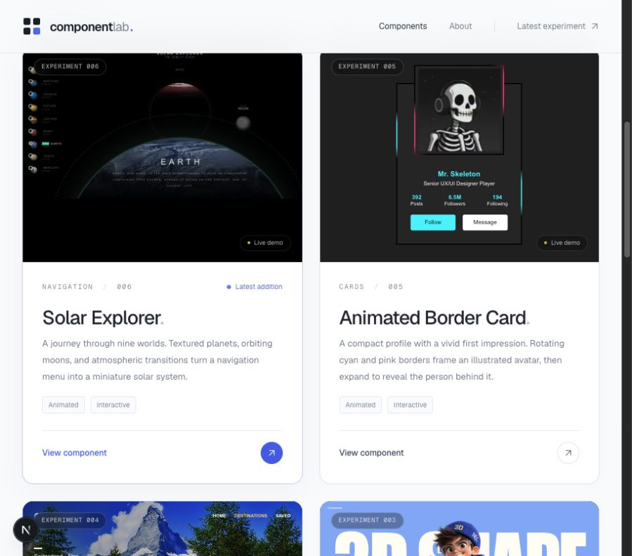
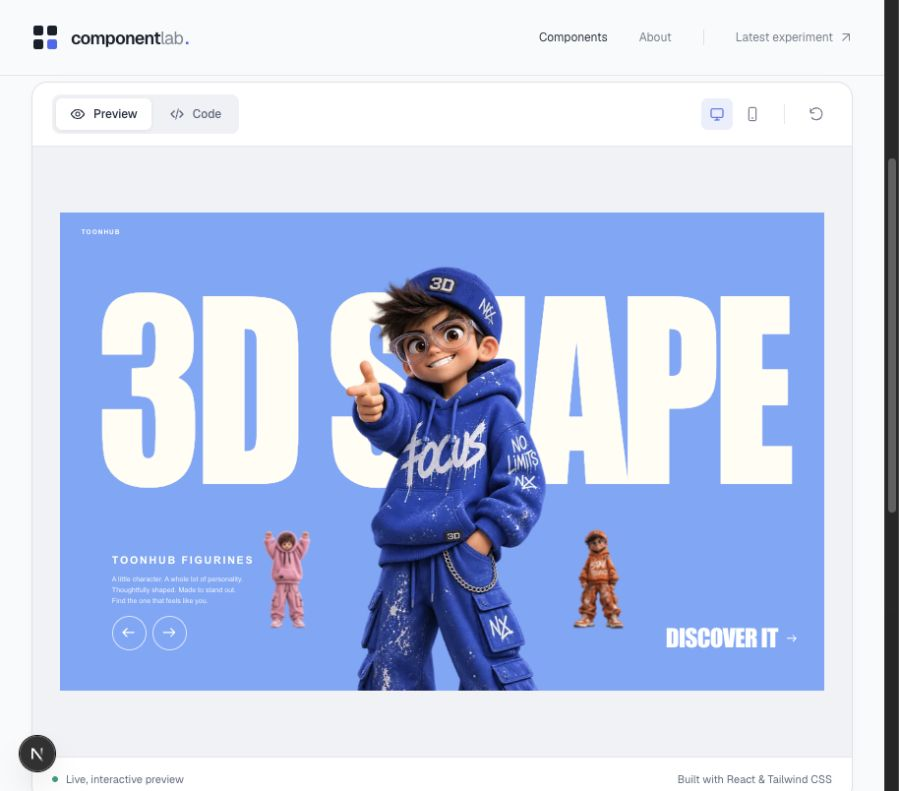

# Component Lab

**21 interactive UI components for React and Next.js**, built with TypeScript and Tailwind CSS 4. A portfolio of animated cards, carousels, forms, and immersive navigation—with working demos and reusable source code.

Browse the homepage’s animated thumbnails, open a component, try **Preview**, then switch to **Code** to copy or download it for your own project.

[Component catalog](#component-catalog) · [Screenshots](#screenshots) · [Run locally](#run-locally) · [Usage & props](docs/component-guide.md)

## Screenshots

Selected views captured during development. These show the gallery layout and an individual component’s Preview/Code interface; the catalog below lists all 21 components.

### Browse the collection



Each card introduces a component and opens its dedicated demo. The current homepage also includes autoplay thumbnails, search, category filters, and a **Pause previews** control.

### Explore a component



Try the full interaction in **Preview**, check desktop or mobile sizing, then open **Code** for the source.

## Component catalog

| Component | Type | What it does |
| --- | --- | --- |
| [Gallery Flip](docs/component-guide.md#use-gallery-flip-in-your-project) | Galleries | A grid of city photographs flips tile by tile into one scene, then unfolds back into the collection. |
| [Sneaker Orbit](docs/component-guide.md#use-sneaker-orbit-in-your-project) | Commerce | A rotating wall of sneakers turns a product catalog into a dimensional browsing experience. |
| [Scorpion Cursor](docs/component-guide.md#use-scorpion-cursor-in-your-project) | Effects | A fine white skeleton follows your pointer across a black canvas, bending its spine, legs, and curling tail. |
| [Love Typography](docs/component-guide.md#use-love-typography-in-your-project) | Typography | A warm yellow stage transforms “I love you” into a tiny beating heart, framed by moving white bars. |
| [Sliding Auth](docs/component-guide.md#use-sliding-auth-in-your-project) | Forms | A soft blue panel glides between login and registration, with a rounded silhouette that adapts to mobile. |
| [Delivery Button](docs/component-guide.md#use-delivery-button-in-your-project) | Buttons | A complete-order button becomes a miniature delivery scene, loading a parcel and driving into a checked success state. |
| [Glass Product Card](docs/component-guide.md#use-glass-product-card-in-your-project) | Commerce | A colorful sneaker floats over frosted glass with a pastel glow, color choices, and compact size controls. |
| [Verso Auth](docs/component-guide.md#use-verso-auth-in-your-project) | Forms | Cream paper and deep forest green trade places through a diagonal transition between sign-in and account creation. |
| [Hover Product Cards](docs/component-guide.md#use-hover-product-cards-in-your-project) | Commerce | Two sneaker cards lift their product images to reveal sizes, color choices, and a purchase action. |
| [Periodic Explorer](docs/component-guide.md#use-periodic-explorer-in-your-project) | Navigation | The periodic table moves into a sphere, a helix, or a three-dimensional grid, with colorful element cards and details. |
| [Keyboard Cards](docs/component-guide.md#use-keyboard-cards-in-your-project) | Cards | Three mechanical keyboards rise above green, dark, and monochrome product cards with changing keycap colors. |
| [Fan Image Slider](docs/component-guide.md#use-fan-image-slider-in-your-project) | Carousel | Fans out landscape photos with smooth selection, swipe and keyboard navigation, autoplay, and an enlarged image view. |
| [Trailhead Card](docs/component-guide.md#use-trailhead-card-in-your-project) | Card | Tilts a layered glass card with your pointer; includes save, trail details, and a checklist download. |
| [Character Reveal Cards](docs/component-guide.md#use-character-reveal-cards-in-your-project) | Cards | Lifts fantasy characters out of their covers on hover, focus, or touch, with a details dialog. |
| [Glowing Login](docs/component-guide.md#use-glowing-login-in-your-project) | Form | Expands a cyan-and-pink neon panel into sign-in, registration, and password-reset forms with validation. |
| [Solar Explorer](docs/component-guide.md#use-solar-explorer-in-your-project) | Navigation | Moves between nine worlds with textured planets, orbiting moons, and planet details. |
| [Animated Border Card](docs/component-guide.md#use-animated-border-card-in-your-project) | Profile card | Expands a profile framed by rotating neon borders, with follow and message actions. |
| [Destination Carousel](docs/component-guide.md#use-destination-carousel-in-your-project) | Carousel | Combines full-scene travel photography, sliding destination cards, autoplay, details, and local favorites. |
| [Toon Carousel](docs/component-guide.md#use-toon-carousel-in-your-project) | Carousel | Slides colorful character illustrations across oversized typography, with swipe, keyboard controls, and character details. |
| [Creative Login](docs/component-guide.md#use-creative-login-in-your-project) | Form · 3D | Pairs an animated Three.js character with a multi-step name-and-email form, review, and submission feedback. |
| [Glass OTP](docs/component-guide.md#use-glass-otp-in-your-project) | Verification form | Presents four-digit code entry in frosted glass, with animated states and a resend cooldown. |

## What’s included

- **Animated gallery:** lightweight thumbnail demos play while visible and pause when the browser tab is hidden. Visitors can pause all previews; reduced-motion preferences are respected.
- **Interactive playground:** each component has its own route, with Preview selected by default, a Code tab, and desktop/mobile preview controls.
- **Copyable source:** copy or download the complete component, including embedded assets where supplied. Long asset strings are folded in the viewer but included in the exported code.
- **Customizable behavior:** typed props and callbacks let you replace demo content and connect your own application logic.

Authentication, verification, messaging, and persistence run as local demos until you connect the relevant callbacks to your own service. See each component’s guide for exact behavior.

## Run locally

Use Node.js **20.9 or later** and npm.

```bash
npm install
npm run dev
```

Open [localhost:3000](http://localhost:3000), select a component, and try its preview.

```bash
npm run lint   # Check source quality
npm run build  # Create a production build
npm start      # Serve the production build
```

Stack: **Next.js 16.3.8 · React 19 · TypeScript · Tailwind CSS 4**. Creative Login also uses **Three.js**.

## Reuse a component

1. Open the component’s **Code** tab in the running app.
2. Copy or download its complete source into your React project.
3. Set up TypeScript and Tailwind CSS 4, install any dependencies listed in its guide, and import it:

```tsx
import FanImageSlider from "@/components/ui/fan-image-slider";

export default function GalleryPage() {
  return <FanImageSlider />;
}
```

Most components include their styles, icons, and artwork in the exported file. **Creative Login** requires `three` and `@types/three`; its Code tab bundles the separate renderer and assets into the portable export. **Destination Carousel** loads its default photos and display font remotely.

See the [component usage guide](docs/component-guide.md) for props, callback examples, dependencies, and asset credits.

## Project map

```text
app/                         Homepage and component routes
components/ui/               Component implementations
components/showcase/         Gallery, autoplay thumbnails, and Preview/Code interface
lib/component-registry.ts    Catalog descriptions and usage examples
lib/component-previews.ts    Demo and thumbnail registrations
lib/component-source.ts      Source export and asset bundling
public/                      Development artwork, models, and credits
docs/component-guide.md      Detailed usage and prop reference
docs/screenshots/            Screenshots used in this README
```

Want to extend the collection? Follow [Add another component](docs/component-guide.md#add-another-component).

## Design and artwork credits

Several experiments are inspired by supplied video references and community designs. Per-component references, artwork sources, and reuse notes are preserved in the [usage guide](docs/component-guide.md) and the relevant asset folders. Replace demo artwork with your own where appropriate.
